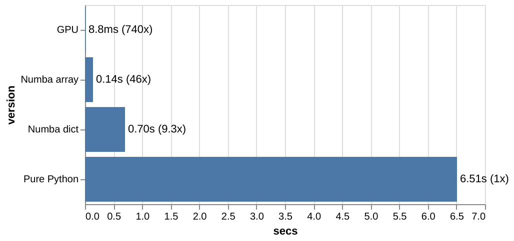
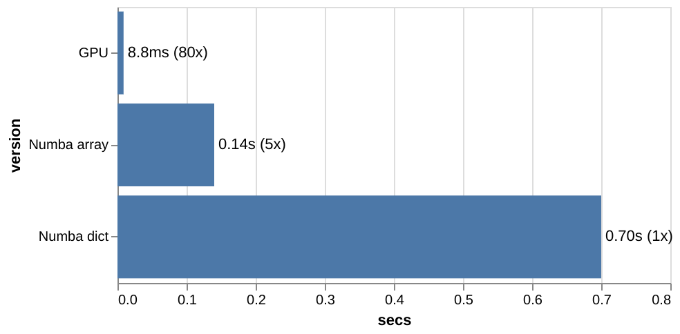

## Advent of code solution comparison in
### pure python, numba, cuda


---

## About me

* I'm Roberto Gambuzzi <!-- .element: class="fragment" data-fragment-index="1" -->
* Principal Software Engineer <!-- .element: class="fragment" data-fragment-index="2" -->
* Writing Python since 2007 <!-- .element: class="fragment" data-fragment-index="3" -->
* Always learning new languages, but always coming back to Python. <!-- .element: class="fragment" data-fragment-index="4" -->
* If you want to connect <!-- .element: class="fragment" data-fragment-index="5" --> https://linktr.ee/gambuzzi <!-- .element: class="fragment" data-fragment-index="5" -->

---

## What this talk will be about

* advent of code solutions
* python
* numba
* cuda

---

## What is advent of code?

If you never did Advent of Code, Advent of code is a code challenge that is published every year in the Christmas period. 

There are 24 challenges every year, you can find them on https://adventofcode.com/

---


## The problem
### 2021 Day 20: Trench Map

https://adventofcode.com/2021/day/20

Longstory Short: you have an initial 1-bit image and you have rules on how to update every pixel of this image. You get a new image. Repeat.

In PART 1 you are asked of doing it 2 times.

In PART 2 you are asked of doing it 50 times.

---

<!-- .slide: style="text-align: left; font-size: 30px;" -->
### how do you evolve the image?

You are given an *image enhancement algorithm* (a string representing 512 bits) and an image.

For each pixel 
* you have to take all the touching pixel and the pixel itself (3x3 = 9 pixels), 
* create a 9 bit number based on these pixels
* do a lookup to the appropriate bit in the *image enhancement algorithm* string
* write the value you get in the pixel position in the new output image

---

<!-- .slide: style="text-align: left; font-size: 30px;" -->
## Let's visualize the problem

Advent of code always provides a simple input that serves as example. Then it provides you the real input to use to get the solution, that often contains some edge cases that the example-input lacks intentionally.

The simple input 

```
..#.#..#####.#.#.#.###.##.....###.##.#..###.####..#####..#....#..#..##..###..######.###...####..#..#####..##..#.#####...##.#.#..#.##..#.#......#.###.######.###.####...#.##.##..#..#..#####.....#.#....###..#.##......#.....#..#..#..##..#...##.######.####.####.#.#...#.......#..#.#.#...####.##.#......#..#...##.#.##..#...##.#.##..###.#......#.#.......#.#.#.####.###.##...#.....####.#..#..#.##.#....##..#.####....##...##..#...#......#.#.......#.......##..####..#...#.#.#...##..#.#..###..#####........#..####......#..#
```

Image 
```
#..#.
#....
##..#
..#..
..###
```
---

<video data-autoplay src="./y2021ex20.mp4" style="height: 500px;"></video>

---

## The first approach, pure python

```python
def parse_input(img):
    # this could possibly be a set, instead of a dict.
    grid = {}

    for y, row in enumerate(img.splitlines()):
        for x, cell in enumerate(row):
            grid[x, y] = 1 if c=='#' else 0
    return grid
```

---
<!-- .slide: style="font-size: 30px;" -->

### the single step

```python [1-17|2-5|6|7-8|9|10-13|14-15|16|17]
def step(enhancement: AnyStr, grid: Dict[Iterable[int] , AnyStr], default: int=0):
    min_x: int = min([x[0] for x in grid if grid[x]])
    max_x: int = max([x[0] for x in grid if grid[x]])
    min_y: int = min([x[1] for x in grid if grid[x]])
    max_y: int = max([x[1] for x in grid if grid[x]])
    new_grid = {}
    for x in range(min_x-2,max_x+3):
        for y in range(min_y-2,max_y+3):            
            n = 0  # the lookup number
            for dx,dy in (
                (-1,-1),(0,-1),(1,-1),
                (-1, 0),(0, 0),(1, 0),
                (-1, 1),(0, 1),(1, 1),):
                n *= 2
                n += grid.get((x+dx,y+dy),default)
            new_grid[x,y] = 1 if enhancement[n] == '#' else 0
    return new_grid
```

---

```python [1-11|2|4-9|11]
def part2(img, enhancement):
    grid = parse_input(img)

    for i in range(50):
        grid = step(
            enhancement, 
            grid, 
            default=i%2 if enhancement[0]=='#' else 0
        )

    return sum(grid.values())
```

---

### What is the speed of this?

```python 
print("part2", part2(img, enhancement))
print(timeit.timeit(
    "part2(img, enhancement)", 
    "from __main__ import part2, img, enhancement", 
    number=1
))
```

```bash 
part2 19340
6.5132104279999794
```

---

## Can numba make it faster?
Spoiler alert: Yes.

### Do I need to change my code?
Nope (well, you have to add decorators)

---
<!-- .slide: style="font-size: 30px;" -->

```python
from numba import njit
```

`njit` is an alias to `@jit(nopython=True)`

```python
@njit
def parse_input(img):
    ...
```

```python
@njit
def step(enhancement: AnyStr, grid: Dict[Iterable[int] , AnyStr], default: int=0):
    ...
```

```python
@njit
def part2(img, enhancement):
    ...
```

---

### What is the speed of numba?

```python
print("part2", part2(img, enhancement))
print(timeit.timeit(
    "part2(img, enhancement)", 
    "from __main__ import part2, img, enhancement", 
    number=1
))
```

```bash  
part2 19340
0.6961225479999484
``` 
<!-- .element: class="fragment" data-fragment-index="1" -->

6.51s -> 0.70s ->  <!-- .element: class="fragment" data-fragment-index="2" -->
**9.3 times faster** <!-- .element: class="fragment" data-fragment-index="2" -->

*numba take a little while to 'compile' the code on the first run* <!-- .element: class="fragment" data-fragment-index="3" -->
---

## and now the GPU

With `cuda` we can use the GPU of our machine (or a colab instance) to work on this problem, that can be parallelized quite well.

---

## Can the GPU make it even faster?
Yes.

### Do I need to change my code?
Yes, quite a bit.

---

## Code changes
* I will not use a dictionary anymore  <!-- .element: class="fragment" data-fragment-index="1" -->
* I will use an array <!-- .element: class="fragment" data-fragment-index="2" -->
* I will use a fixed size array, big enough to contain my final image <!-- .element: class="fragment" data-fragment-index="3" -->
* On the python side I will use a numpy array <!-- .element: class="fragment" data-fragment-index="4" -->
* I will not allocate a new array (previously a dictionary) at every loop <!-- .element: class="fragment" data-fragment-index="5" -->
* To be fair with numba, I will rewrite the numba solution with the same new logic <!-- .element: class="fragment" data-fragment-index="6" -->

---


```python [1-10|1-2|6|7-8|9|10]
from numba import njit, cuda
import numpy as np

@njit
def parse_input(img):
    ret = np.full((200, 200), False)
    for y, row in enumerate(img.splitlines()):
        for x, cell in enumerate(row):
            ret[50 + x, 50 + y] = cell=='#'
    return ret
```

* `ret` is 200 by 200 array of booleans, 
* 50 is the offset to avoid negative numbers, because the image also expands in negatie directions, one pixel per step

---
<!-- .slide: style="font-size: 30px;" -->


```python [1-15|1|3|4|5|6-14|15]
@cuda.jit
def GPUstep(ingrid, outgrid, enhancement, default):
    x, y = cuda.grid(2)
    if x<ingrid.shape[0] and y<ingrid.shape[1]:
        n = 0
        for dx,dy in (
            (-1,-1),(0,-1),(1,-1),
            (-1, 0),(0, 0),(1, 0),
            (-1, 1),(0, 1),(1, 1),):
            n *= 2
            if (not 0<=x+dx<ingrid.shape[0]) or (not 0<=y+dy<ingrid.shape[1]):
                n += default
            else:
                n += 1 if ingrid[x+dx,y+dy] else 0
        outgrid[x][y] = enhancement[n]
```

---

<!-- .slide: style="font-size: 30px;" -->

```python [1-18|2-7|8-13|14|15-17|18]
def part2GPU(img, enhancement):
    np_grid = parse_input(img)
    d_grid = cuda.to_device(np_grid)
    new_grid = cuda.to_device(
        np.full((np_grid.shape[0], np_grid.shape[1]), False)
    )
    d_enha = cuda.to_device(np.fromiter((x=='#' for x in enhancement), bool))
    threads_per_block = (16, 16)
    blocks_per_grid_x = (np_grid.shape[0] + threads_per_block[0] 
                        - 1) // threads_per_block[0]
    blocks_per_grid_y = (np_grid.shape[1] + threads_per_block[1] 
                        - 1) // threads_per_block[1]
    blocks_per_grid = (blocks_per_grid_x, blocks_per_grid_y)
    for i in range(50):
        GPUstep[blocks_per_grid, threads_per_block] \
            (d_grid, new_grid, d_enha, i%2 if ench[0]=='#' else 0)
        d_grid, new_grid = new_grid, d_grid
    return np.count_nonzero(d_grid)
```

---

```python 
print("GPU part2", part2GPU(img, enhancement))
print(timeit.timeit(
    "part2GPU(img, enhancement)", 
    "from __main__ import part2GPU, img, enhancement", 
    number=1
))
```

```bash
GPU part2 19340
0.008758712000002333
```
<!-- .element: class="fragment" data-fragment-index="1" -->

6.51s -> 0.0088s ->  <!-- .element: class="fragment" data-fragment-index="2" -->
**740 times faster** <!-- .element: class="fragment" data-fragment-index="2" -->

---
<!-- .slide: style="font-size: 25px;" -->
## To be fair, let's rewrite also the numba solution with arrays

```python
@njit
def step(enhancement, grid, default=0):
    new_grid = np.full((200, 200), False)
    for x in range(grid.shape[0]):
        for y in range(grid.shape[1]):
            n = 0
            for dx,dy in (
                (-1,-1),(0,-1),(1,-1),
                (-1, 0),(0, 0),(1, 0),
                (-1, 1),(0, 1),(1, 1),):
                n *= 2
                if (not 0<=x+dx<grid.shape[0]) or (not 0<=y+dy<grid.shape[1]):
                    n += default
                else:
                    n += 1 if grid[x+dx,y+dy] else 0
            new_grid[x,y] = enhancement[n] == '#'
    return new_grid

@njit
def part2(img, enhancement):
    grid = parse_input(img)
    for i in range(50):
        grid = step(enhancement, grid, default=i%2 if enhancement[0]=='#' else 0)
    return np.count_nonzero(grid)    
```

---

```python 
print("jit part2", part2(img, enhancement))
print(timeit.timeit(
    "part2(img, enhancement)", 
    "from __main__ import part2, img, enhancement", 
    number=1
))

```

```bash
jit part2 19340
0.13827341399999682
```
<!-- .element: class="fragment" data-fragment-index="1" -->

##### compared to pure python <!-- .element: class="fragment" data-fragment-index="2" -->
6.51s -> 0.14s ->  <!-- .element: class="fragment" data-fragment-index="2" -->
**46 times faster** <!-- .element: class="fragment" data-fragment-index="2" -->

##### compared to numba with dict <!-- .element: class="fragment" data-fragment-index="3" -->
0.70s -> 0.14s ->  <!-- .element: class="fragment" data-fragment-index="3" -->
**5 times faster** <!-- .element: class="fragment" data-fragment-index="3" -->

but not handling any-size-images <!-- .element: class="fragment" data-fragment-index="4" -->

---

## Recap



---

## Recap



---

### Questions?

# Q